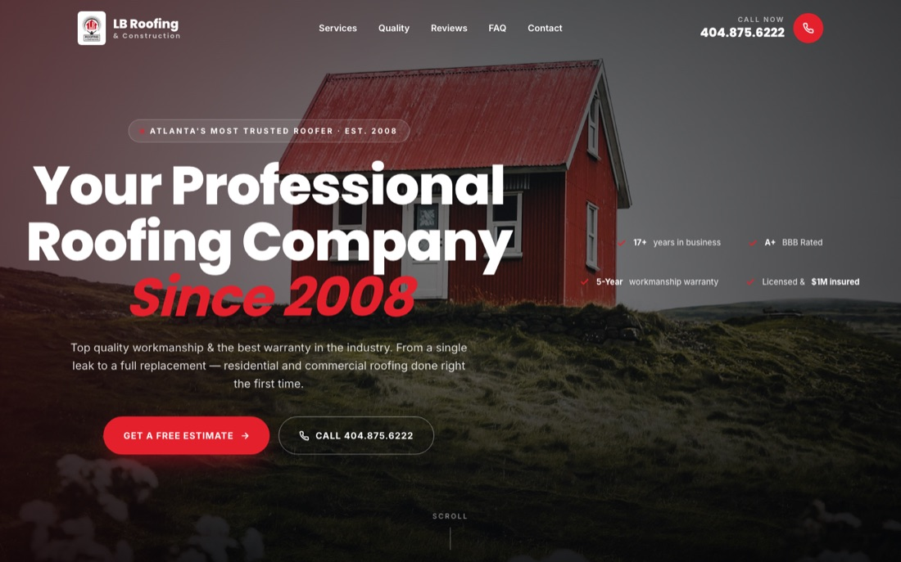
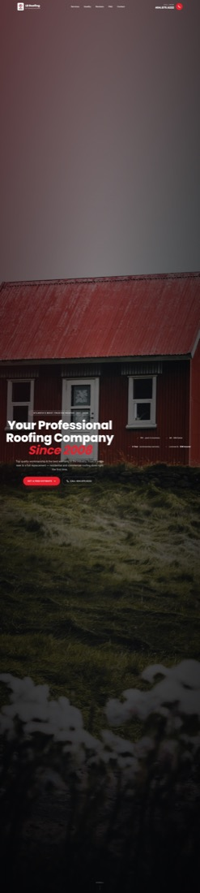
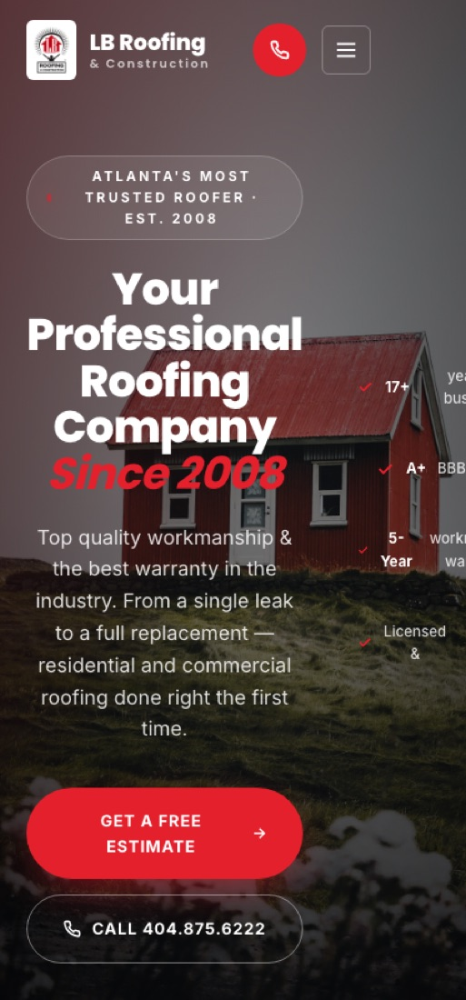

# LB Roofing & Construction — Redesign **Version 2** (Conversion-first Landing)

A redesign of [lbroof.com](https://lbroof.com) inspired by the "Roofing USA" landing-page archetype,
elevated with modern motion, depth, and a strong conversion flow.
All original brand assets, copy, contact details and trust signals are preserved.

---

## 🖼️ Preview

**Desktop hero (1440 wide)**



**Full page (scroll capture)**



**Mobile (420 wide)**



---

## 🚀 Deploy to Netlify — drag & drop

This folder is fully self-contained — no build step, no dependencies.

1. Open <https://app.netlify.com/drop> (sign in with email or GitHub — free)
2. **Drag this entire `lbroof-v2` folder** onto the drop zone (drag the folder itself, not its contents)
3. Wait ~10 seconds — Netlify shows a live URL like `https://random-name.netlify.app`
4. Optional → **Site settings → Change site name** for a memorable subdomain
5. Optional → **Domain management → Add custom domain** to point your own domain at it

> 💡 Alternatively, upload `lbroof-v2.zip` if your browser handles folders strangely.

### What gets deployed

```
lbroof-v2/
├── index.html             ← the redesigned site (renamed from version2.html)
├── README.md              ← this doc (also served as /README.md)
├── assets/
│   ├── logo.png           ← original LB Roofing logo
│   ├── hero-roof.jpg      ← hero background
│   ├── hero-house.jpg     ← quality section image
│   ├── svc-repair.jpg     ← service card images (×6)
│   ├── svc-replace.jpg
│   ├── svc-new.jpg
│   ├── svc-storm.jpg
│   ├── svc-commercial.jpg
│   └── svc-gutters.jpg
└── docs/
    ├── preview-hero.jpg
    ├── preview-full.jpg
    └── preview-mobile.jpg
```

---

## 🎨 What this version looks like — section by section

| # | Section | Key features |
|---|---|---|
| 1 | **Transparent floating nav** | Logo + nav + phone overlay the hero, then **solidifies to white with shadow** on scroll. Circular red call icon on the right. |
| 2 | **Full-viewport hero** | Roof photo with dark gradient + subtle red overlay. Pulsing red dot badge ("Atlanta's most trusted roofer · Est. 2008") · giant Poppins headline ("Your Professional Roofing Company *Since 2008*") · red pill CTA + outline CTA. |
| 3 | **Hero trust strip** | 17+ years · A+ BBB · 5-Year warranty · $1M insured — with red checkmarks. Animated scroll cue at the bottom. |
| 4 | **6 image service cards** | Roof Repair (with "Most Popular" tag) · Replacement · New Construction · Storm Damage · Commercial · Gutters & Siding. Hover zooms the image and slides the arrow icon. |
| 5 | **Quality split section** | Left: 6-item quality checklist ("we don't take shortcuts…") with red CTA. Right: large house photo with floating "5★ A+ BBB Rated" badge. |
| 6 | **Dark stats ribbon** | 17+ years · 5-Year warranty · $1M coverage · A+ BBB. Red radial glow accent. |
| 7 | **Certification chips** | BBB · Angie's List · HGTV · Owens Corning · CertainTeed · GAF. Lift on hover. |
| 8 | **Auto-rotating testimonial slider** | 3 verified reviews (BBB / Angie's / Google), star rating, initials avatar, animated dots, 6.5s autoplay. |
| 9 | **FAQ accordion** | 6 questions in a styled side-by-side layout, with a "Talk to a roofer" call-out card. |
| 10 | **Contact section** | Two-column layout. Left: dark info panel with phone, address, hours, socials. Right: light grey form (Name · Phone · Email · Service · Message) with red submit pill. |
| 11 | **Footer** | Logo + tagline · Services · Service Areas · Contact details. |
| 12 | **Floating "Call now" pill** | Appears after 800px scroll, bottom-right corner. Red, sticky, taps directly to call. |

---

## 🧰 Tech stack

- **Pure HTML + CSS + JS** — zero dependencies, no build step.
- **Typography:** Poppins (display) + Inter (body), via Google Fonts.
- **Animations:** IntersectionObserver scroll reveals · CSS transitions · pulsing badge · scroll cue bobbing.
- **Interactions:** Mobile drawer menu, auto-playing testimonial slider with manual dots, FAQ accordion, sticky floating call button.
- **Total weight:** ~1.8 MB (mostly imagery).

---

## ⚙️ Customizing

### Change phone or address

Open `index.html` and search-replace:
- `404.875.6222` → your new number
- `3101 Cobb Pkwy SE, Suite 124` → your new address

### Change brand colors

Find this near the top of the `<style>` block:

```css
:root{
  --red:#E5202D;
  --red-2:#C51823;
  --ink:#161A1F;
  ...
}
```

### Swap hero or service images

- Hero background: replace `assets/hero-roof.jpg` (recommended 1920×1080, < 800 KB)
- Quality section image: replace `assets/hero-house.jpg`
- Service cards: replace `assets/svc-repair.jpg`, `svc-replace.jpg`, `svc-new.jpg`, `svc-storm.jpg`, `svc-commercial.jpg`, `svc-gutters.jpg` (recommended 900×600)
- Logo: replace `assets/logo.png`

Keep the filenames the same — no code changes needed.

### Wire the contact form to Netlify Forms (recommended)

The form currently uses a stub `onsubmit` handler. To capture real submissions in your Netlify dashboard:

**1. In `index.html`, find:**

```html
<form class="contact-form reveal" onsubmit="event.preventDefault();…">
```

**2. Replace with:**

```html
<form class="contact-form reveal" name="estimate" method="POST"
      data-netlify="true" netlify-honeypot="bot-field">
  <input type="hidden" name="form-name" value="estimate" />
  <p style="display:none"><label>Don't fill: <input name="bot-field" /></label></p>
```

**3. Add `name="…"` to every input/select/textarea inside the form:**

```html
<input type="text" name="name" required placeholder="Your full name" />
<input type="tel"  name="phone" required placeholder="404.555.0000" />
<input type="email" name="email" placeholder="you@email.com" />
<select name="service">…</select>
<textarea name="message"></textarea>
```

Submissions appear under **Site → Forms** in the Netlify dashboard. No backend needed.

### Replace placeholder testimonials

In `index.html` find `<div class="testi-slider">` and edit the three `<div class="testi-slide">` blocks. Each has the same structure (stars · quote · avatar initials · name · city + source).

---

## 📋 Original content sources (from lbroof.com)

| Field | Value |
|---|---|
| Brand | LB Roofing & Construction |
| Tagline | "Pound for pound, the best roof in town" |
| Established | August 2008 |
| Phone | 404.875.6222 |
| Address | 3101 Cobb Pkwy SE, Suite 124, Atlanta, GA 30339 |
| Hours | Monday – Saturday, 8:00 am – 7:00 pm |
| Warranty | 5-year workmanship |
| Insurance | $1M general liability |
| BBB | A+ accredited |
| Certifications | Owens Corning Preferred · CertainTeed Master Shingle Applicator · GAF Weather Stopper · LEAD Safe |
| Featured on | HGTV (Elbow Room Atlanta) |
| Service areas | Atlanta · Marietta · Kennesaw · Woodstock · Alpharetta · Cumming · Stone Mountain |
| Socials | facebook.com/LBRoofingandConstruction · twitter.com/LBRoof · flickr/75968791@N02 |

**Testimonials** — original site has none. Placeholders are realistic and attributed to BBB / Angie's List / Google with initials only. Replace before launch.

---

## ✅ Browser support

All modern browsers (Chrome, Firefox, Safari, Edge — last 2 versions). No IE.
