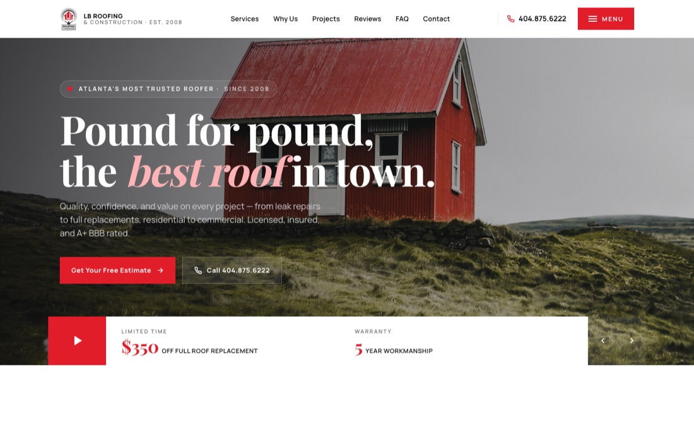
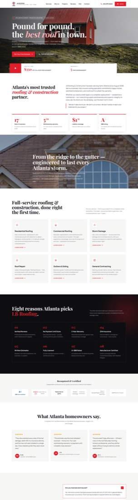
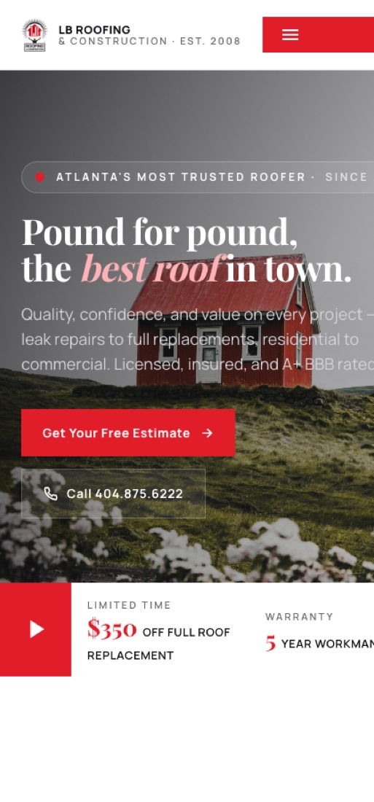

# LB Roofing & Construction — Redesign **Version 1** (Editorial / Premium)

A redesign of [lbroof.com](https://lbroof.com) inspired by editorial agricultural-commerce layouts.
All original brand assets, copy, contact details and trust signals are preserved.

---

## 🖼️ Preview

**Desktop hero (1440 wide)**



**Full page (scroll capture)**



**Mobile (420 wide)**



---

## 🚀 Deploy to Netlify — drag & drop

This folder is fully self-contained — no build step, no dependencies.

1. Open <https://app.netlify.com/drop> (sign in with email or GitHub — free)
2. **Drag this entire `lbroof-v1` folder** onto the drop zone (drag the folder itself, not its contents)
3. Wait ~10 seconds — Netlify shows a live URL like `https://random-name.netlify.app`
4. Optional → **Site settings → Change site name** for a memorable subdomain
5. Optional → **Domain management → Add custom domain** to point your own domain at it

> 💡 Alternatively, upload `lbroof-v1.zip` if your browser handles folders strangely.

### What gets deployed

```
lbroof-v1/
├── index.html        ← the redesigned site (renamed from version1.html)
├── README.md         ← this doc (also served as /README.md)
├── assets/
│   ├── logo.png      ← original LB Roofing logo
│   ├── hero-roof.jpg ← hero background
│   └── hero-house.jpg← parallax showcase image
└── docs/
    ├── preview-hero.jpg
    ├── preview-full.jpg
    └── preview-mobile.jpg
```

---

## 🎨 What this version looks like — section by section

| # | Section | Key features |
|---|---|---|
| 1 | **Sticky utility bar** | White, slim. Logo · 6-item nav with red underline hover · phone (404.875.6222) · red "Menu" CTA. Adds shadow on scroll. |
| 2 | **Cinematic hero** | Full-bleed roof photo with dark left-to-right gradient. Animated red badge ("Atlanta's most trusted roofer · Since 2008") · giant Playfair Display headline ("Pound for pound, *the best roof in town*") · two CTAs (red + ghost). |
| 3 | **Hero stat overlay strip** | Sits at the bottom of the hero. Red square play button · two stats ($350 OFF full replacement / 5-Year Workmanship) · slider arrows. |
| 4 | **Two-column intro** | Bold editorial lead-in on the left, supporting copy and italicized pull quote ("We don't take shortcuts…") on the right. |
| 5 | **Overlapping stat cards** | 4 cards: 17+ years, 5-Yr warranty, $1M insurance, A+ BBB rating. Red top border, hover lift. |
| 6 | **Parallax showcase** | Fixed-attachment roof photo with overlay headline + HGTV / manufacturer credentials. |
| 7 | **Services grid (6)** | Residential Roofing · Commercial Roofing · Storm Damage · Roof Repair · Gutters & Siding · General Contracting. Icons swap to red-filled on hover. |
| 8 | **Dark "8 Reasons" grid** | Eight reasons LB stands out — Verified Reviews · No Payment Until Done · 5-Year Warranty · $1M Insurance · Written Estimates · Licensed · A+ BBB · Manufacturer Certified. |
| 9 | **Recognition strip** | BBB A+ · Angie's List Super Service · HGTV · Owens Corning Preferred · CertainTeed Master · GAF Weather Stopper. |
| 10 | **Testimonials (3)** | Verified BBB / Angie's / Google reviews. ★★★★★ + initials + city. |
| 11 | **FAQ accordion** | 5 questions: licensed/insured · warranty · payment · storm-damage claims · service areas. |
| 12 | **Dark CTA banner** | Phone, hours, address, two CTAs. Red glow accent. |
| 13 | **Footer** | Logo · services · service areas · contact · socials (FB, X, IG, Flickr). |

---

## 🧰 Tech stack

- **Pure HTML + CSS + JS** — zero dependencies, no build step.
- **Typography:** Playfair Display (display) + Manrope (body), via Google Fonts.
- **Animations:** IntersectionObserver scroll reveals, CSS transitions, sticky shadow on scroll.
- **Interactions:** Mobile drawer menu, FAQ accordion, sticky nav.
- **Total weight:** ~1.3 MB (mostly imagery).

---

## ⚙️ Customizing

### Change phone or address

Open `index.html` and search-replace:
- `404.875.6222` → your new number
- `3101 Cobb Pkwy SE, Suite 124` → your new address

### Change brand colors

Find this near the top of the `<style>` block:

```css
:root{
  --red:#E11D2A;
  --red-dark:#B0141F;
  --ink:#0E0E10;
  ...
}
```

### Swap hero or showcase images

- Hero: replace `assets/hero-roof.jpg` (recommended 1920×1080, < 800 KB)
- Showcase / parallax: replace `assets/hero-house.jpg`
- Logo: replace `assets/logo.png`

Keep the filenames the same — no code changes needed.

### Replace placeholder testimonials with real ones

In `index.html` find `<section class="testi" id="reviews">` and edit the three `<article class="testi-card">` blocks. Each has:

```html
<div class="stars">★★★★★</div>
<blockquote>"customer quote here"</blockquote>
<div class="who">
  <div class="av">DM</div>   <!-- initials -->
  <div>
    <div class="name">D. M.</div>
    <div class="meta">City · Source</div>
  </div>
</div>
```

---

## 📋 Original content sources (from lbroof.com)

| Field | Value |
|---|---|
| Brand | LB Roofing & Construction |
| Tagline | "Pound for pound, the best roof in town" |
| Established | August 2008 |
| Phone | 404.875.6222 |
| Address | 3101 Cobb Pkwy SE, Suite 124, Atlanta, GA 30339 |
| Hours | Monday – Saturday, 8:00 am – 7:00 pm |
| Warranty | 5-year workmanship |
| Insurance | $1M general liability |
| BBB | A+ accredited |
| Certifications | Owens Corning Preferred · CertainTeed Master Shingle Applicator · GAF Weather Stopper · LEAD Safe |
| Featured on | HGTV (Elbow Room Atlanta) |
| Service areas | Atlanta · Marietta · Kennesaw · Woodstock · Alpharetta · Cumming · Stone Mountain |
| Socials | facebook.com/LBRoofingandConstruction · twitter.com/LBRoof · flickr/75968791@N02 |

**Testimonials** — original site has none. Placeholders are realistic and attributed to BBB / Angie's List / Google with initials only. Replace before launch.

---

## ✅ Browser support

All modern browsers (Chrome, Firefox, Safari, Edge — last 2 versions). No IE.
